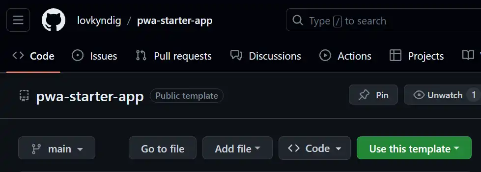

# How to use this PWA Starter App?
The easiest wat is to install it as a template from [GitHub](https://github.com/lovkyndig/pwa-starter-app), and then create the content in markdown-format. Thats it. Don't thing about html, css and javascript. 

## Ordinary Install
```bash
# Change yarn with "npm", "npmn" or wathever you want
yarn install
```

## Use this template


Well, here you see a screen-clip of the screen you have to find to do it. [Here is the link](https://github.com/lovkyndig/pwa-starter-app)

## Content and config-files
The `md`-content and the constants in `app.config`and `nuxt.config` is all that need to be changed to create a new website or app.

### Content
The content is written in markdown (md) format. All files in the `content`-folder.

### app.config
The `app.config`- holds all the constants. Change them like you want. 

`App.config` is a copy of the same file in layer 1 _Create Google App_.

### nuxt.config
`nuxt.config` holds only the **runtimeConfig**-constants.

## Images
Well, don't forget to change all the images in the `public/pwa`-folder.

All the images in the `content`-folder is cloned and inserted automatic in the `public`-folder, on `dev`-command.

## manifest.webmanifest
This file holds all the info for the PWA. Changes all text and images. Here you see what size your pwa-images has to have.

## Privacy policy
Don't forget to change the names in the `privacy policy`.

## rss and sitemap
Rss and sitemap is created on build or generate.

Copy them from the `build`-folders and put them inside `public`-folder.

<!-- 
Made by laywer Kyrie Eleison 2023.
-->